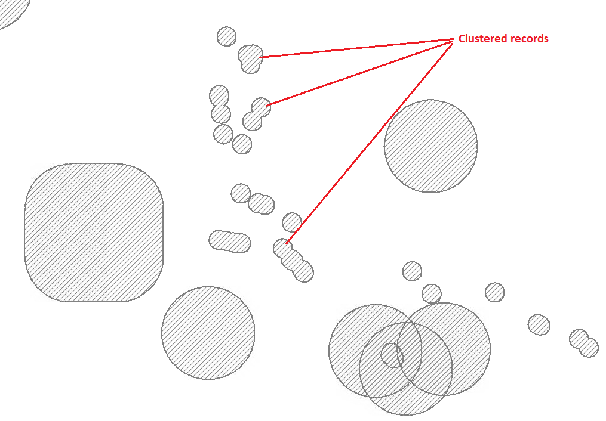

.. index::
	single: Running the tool

****************
Running the tool
****************

As discussed in the :doc:`Setting up the tool <../setup/setup>` section, the Data Buffer tool is operated from a MapInfo workspace or ArcGIS document within which the GIS layers required to run the tool are already loaded. It also relies on the configuration document for setting up the tool. Therefore, before running the tool, ensure the following conditions are met:

- A MapInfo or ArcGIS document has been created which contains any GIS layers that may be included in the process. 
- The XML configuration document has been set up correctly, both for general settings and for each individual layer that can be used for input. It is also named correctly. If the tool is run from MapInfo the XML file must be in the same directory as the tool MapBasic application (.MBX).
- The Data Buffer tool has been installed and is loaded in the GIS software.

.. seealso::
	Please refer to the :doc:`setup <../setup/setup>` section for further information about any of these requirements.

.. raw:: latex

   \newpage

.. index::
	single: Opening the form

Opening the form
================

To open the Data Buffer tool inn MapInfo, open the tool in the `Tools` menu (**Tools... -> Data Buffer**), as shown in :numref:`figRunBuffer`. In ArcMap, open the Data Buffer tool by clicking on the tool button (:numref:`figRunBufferArc`).

.. _figRunBuffer:

.. figure:: figures/RunBuffer.png
	:align: center

	Launching the Data Buffer tool (MapInfo)

.. _figRunBufferArc:

	Launching the Data Buffer tool (ArcGIS)

If there are any structural issues with the XML document, the tool will display a message that it has encountered an error, and not load any further. If any of the input layers that are listed in the configuration document are not present in the active workspace a warning will be shown (:numref:`figLaunchWarning`). The layers that are missing will not be loaded into the form and so cannot be included in the process.

.. _figLaunchWarning:

	Example warning message when any GIS layers are not found

.. raw:: latex

   \newpage

Provided that the XML document is otherwise correct, the form will display (:numref:`figDisplayForm`).

.. _figDisplayform:

	The form displaying the available input layers

.. raw:: latex

   \newpage

.. index::
	single: Using the form

Using the form
==============

The form can be used to process as many input layers as required into a single output layer. Select the input tables that you would like to include and press **OK**.

.. _figSelectOptions:

	Select the required input layers on the form

.. caution::
	The tool can run for a considerable amount of time dependent on the number of input layers and records that are being processed.

.. raw:: latex

   \newpage

Progress is shown in a progress window in MapInfo (:numref:`figProgress`), and as a series of status messages in ArcMap (:numref:`figProgressArc`).

.. _figProgress:

	Progress window during the process (MapInfo)

.. _figProgressArc:

	Progress window during the process (ArcGIS)

.. raw:: latex

   \newpage

When the process finishes it asks the user whether to close the form or keep it open for subsequent use (:numref:`figFinished`).

.. _figFinished:

	Prompt to close form when process completes

.. raw:: latex

   \newpage

Once the user makes a choice the log file is shown (:numref:`figLogFile`). This should be checked thoroughly to ensure that all expected input tables have been processed and the number of output records is as expected.

.. _figLogFile:

	Example log file shown for review

You can now repeat the process for different input files if required.

.. raw:: latex

   \newpage

.. index::
	single: Output results

Output results
==============

The output records are saved in the GIS layer specified by the user when the tool was run. :numref:`figResults` shows an example of an output layer with some records **clustered** because they are from the same input layer, have the same key column values and are within the specified distance of each other.

.. _figResults:

	Example output layer

The log file results of the process is saved in the :ref:`LogFilePath <logfilepath>` folder as specified in the XML configuration document.
