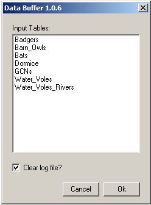

************
Introduction
************

.. index::
	single: Background

Background
==========

Many LERCs will generate GIS layers containing details of records they hold of protected, notable and/or invasive non-native species. These GIS layers can be useful for many partner organisations such as local planning authorities, nature conservation bodies and utility companies. However, sometimes the overwhelming quantity of records means there may be too many records to identify 'hotspots' or areas where species may be impacted by upcoming development pressure or ground works.

Supplying partner organisations with information relating to a smaller set of species will reduce the number of records, which may help to identify where any given species has been recorded. However, even with just a handful of species it can be hard to determine potential species disturbance when species have different levels of mobility and ranges. One approach is to provide species 'alert' layers by buffering each record's location with an area related to their mobility or according to planning guidance. Unfortunately, making the spatial range of the records larger can only make analysis even worse as neighbouring records may overlap one another and records at the same location will be stacked on top of each other.

A simple idea is to reduce the number of multiple 'stacked' records by **combining** records for the same species at the same location into a single record. Similarly, **clustering** records for the same species within a given distance of each other will reduce the number of overlapping buffer areas by replacing them with a single but larger contiguous area. Whilst these processes can be done manually in a GIS application it can be tedious, repetitive and prone to user error. The ideal solution therefore is a tool that performs these tasks in an automated way.

The Data Buffer tool was originally developed for Thames Valley Environmental Records Centre (TVERC) and implemented in MapInfo, and subsequently a version in ArcGIS was developed. It is available for use by other LERCs and, if required, a version could be developed for QGIS.

.. raw:: latex

   \newpage

.. index::
	single: Tool overview

Tool overview
=============

The Data Buffer tool is configurable in a flexible way according to the requirements of the LERC or individual user through a configuration document. Once set up, the tool is integrated into the user interface of the GIS application and presented there as menu item. The tool itself has a simple interface (:numref:`figUI`), requiring a minimum of input (the user is requested to select which layers to buffer and where to create the output layer).

.. _figUI:

	The Data Buffer tool interface

GIS layers available for use by the tool must be loaded in the GIS application and must also be defined in the configuration document. Once the process is complete the combined output layer is saved in the selected location and a log file is generated which records the steps performed. The process is discussed in this document in more detail in the section on :doc:`running the tool <../execute/execute>`.

.. raw:: latex

   \newpage

The details of how to process each GIS layer included is done via a configuration document written in XML. Using this document the user can configure all the parts of the process, for example:

* The name of each input layer when loaded in the GIS workspace.
* The columns to include from each input layer in the combined output layer.
* The default location of the output folder.
* The criteria to use and the sort order to apply when selecting records from each input layer.
* The buffer size and dissolve size to apply when combining and dissolving records.
* The symbology to apply to the new output layer.

Using this configuration file, each individual LERC can tailor the Data Buffer tool to its individual requirements. Examples of the XML file are included in the :doc:`../appendix/appendix`, and the process of setting up this file is discussed in the section on :doc:`setting up the tool <../setup/setup>`. 

.. index::
	single: Benefits

Benefits
========

There are a number of clear benefits to using the Data Buffer tool for generating buffered species alert layers. 

1. The tool, by encapsulating and automating the process, saves considerable time over carrying out this process manually.
#. Both the process and the output are standardised, therefore minimising the risk of user error that is present in a manual process.
#. By specifying the process and output of the tool centrally through the configuration file, the output for each execution is consistent regardless of the individual executing the tool. This leads to comparability of results and a predictable experience for the users.
#. The process is repeatable and, through the inclusion of the log file, automatically documented.