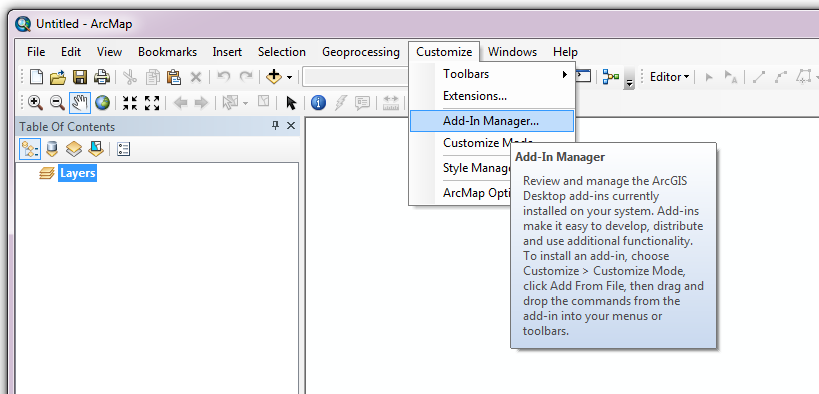

*******************
Setting up the tool
*******************

Before the Data Buffer tool will function, it needs to be installed and configured. It is recommended that the configuration is carried out first.

.. index::
	single: Configuring the tool

Configuring the tool
====================

The configuration is stored in an XML file called 'DataBuffer.xml', examples of which can be found in the :doc:`Appendix <../appendix/appendix>`. Attributes and settings are presented as nodes (beginning with a start node, e.g. ``<example>``, and finishing with an end note, e.g. ``<\example>``), with the value for the setting held between the ``<value>`` and ``<\value>`` tag. 

.. caution:: 
	The name of the configuration file must be 'DataBuffer.xml'. The tool will not load if a different name is used.

.. note:: 
	The configuration file is slightly different between MapInfo and ArcGIS version. Make sure you are using the correct version.

The XML file can be edited in a text editor such as Notepad or Wordpad, or using a more feature rich XML editor such as as `Sublime Text <https://www.sublimetext.com/3>`_. The configuration file is split into three sections:

_`General attributes`
	General and default attributes for the tool.

_`Input Tables`
	Deals with how each input GIS layer should be handled.

_`Output Table`
	Deals with how the new output GIS layer should be created.

.. caution::
	It is important that the structure of the file is maintained as it is presented in the :doc:`Appendix <../appendix/appendix>`. Any changes to the structure may result in the Data Buffer tool not loading, or not working as expected.

Once editing has been completed and the edits have been saved, it is recommended that the configuration file is opened using an internet browser such as Internet Explorer which will help highlight any editing errors – only if the structure of the file is valid will the whole file be displayed in the internet browser.

.. note::
	It is recommended that the configuration file is kept in a central (network) location, so that all users use the same configuration. Additionally, it is essential that the configuration file is kept in the same folder as the compiled version of the tool.

.. index::
	single: Special characters in XML

.. raw:: latex

   \newpage

Special characters in XML
-------------------------

The characters ``&``, ``<`` and ``>`` are not valid within values and, so in order to be used, must be **escaped** with XML entities as follows:

<
	This must be escaped with ``&lt;`` entity, since it is assumed to be the beginning of a tag. For example, ``RecYear &lt; 2010``

>
	This should be escaped with ``&gt;`` entity. It is not mandatory -- it depends on the context -- but it is strongly advised to escape it. For example, ``RecYear &gt; 1980``

&
	This must be escaped with ``&amp;`` entity, since it is assumed to be the beginning of a entity reference. For example, ``TaxonGroup = 'Invertebrates - Dragonflies &amp; Damselflies'``

.. index::
	single: Setup; MapInfo

Setup for MapInfo
-----------------

.. index::
	single: General attributes; MapInfo

General attributes for MapInfo
******************************

The first section of the configuration file deals with a series of general attributes for the Data Buffer tool. Each node specifies where files will be saved, where the log file will be saved as well as other overall settings. Details on these attributes (and their typical values where known) are outlined below. The list follows the order within which the attributes are found in the configuration file. This version of the configuration details is valid for the MapInfo version 1.0.7 of the Data Buffer tool.

_`ToolTitle`
	The title to use for the program in the MapInfo Tools menu.

_`LogFilePath` 	
	The folder to be used for storing log files. This folder must already exist.

_`DefaultPath`
	The default folder where output GIS layers will be stored. This can be overridden by the user when executing the tool.

.. index::
	single: Input table attributes; MapInfo

Input table attributes for MapInfo
**********************************

.. _InTables:

The details of all the input layers that can be included in the process are found within the ``<InTables>`` node. For each GIS layer to be included in the process a new child node must be created. The node name (e.g. ``<Badgers>``) is a user-defined name used to identify an individual layer - it must be unique. This name is name of the layer as it will be shown in the tool interface, and can be different from the layer name as it is known in the active MapInfo workspace (which will be set in a subsequent child node). A simple example of a map layer definition with limited attributes is shown in :numref:`figXMLExampleMapInfo`.

.. tip::
	If you wish to display spaces in any layer names in the tool menu use an underscore (``_``) for each space in the node name for the layer. XML does not allow spaces in node names, but the tool will translate these underscores into spaces when the form is opened.

.. _figXMLExampleMapInfo:

	Simplified example of input layer attributes configuration (MapInfo)

The attributes that are required for each input table are as follows:

TableName
	The name of the layer as it is known in the active workspace.

Columns
	A comma-separated list of columns that should be included in the data selected from this layer during the process. The column names (not case sensitive) should match the column names in the source table.

WhereClause
	Selection criteria that should be used to select records from this layer. This clause could, for example, ensure records are only included that have been entered after a certain date, are verified, are presence (not absence) records, or are a subset for a particular species. Leave this entry blank to select all records from the input layer.

	.. note::
		Any clause specified here must adhere to MapInfo SQL syntax as the clause will be run within MapInfo.

SortOrder
	A comma-separated list of columns indicating the order the data should be selected from this layer. The column names (not case sensitive) should match the column names in the source table.

	.. note::
		The order of the records may be important when it comes to identifying records with the same **key** attributes (e.g. species name(s), grid reference, location name). Hence it is recommended that the key attribute columns are specified in the sort order.

BufferSize
	The size of the buffer (in metres) to apply to records before being added to the output layer. A value of 0 (zero) indicates that the records will not be buffered for this input layer.

DissolveSize
	The proximity (in metres) of records that are to be dissolved together. Records within this distance of each other will be dissolved together when output to form a single contiguous area. A value of 0 (zero) indicates that the records should not be dissolved.

	.. note::
		Even if records are not dissolved (either because they are not within the specified distance of each other or because the value is 0) they may be combined together if their **key** attributes are the same.

.. index::
	single: Output table attributes; MapInfo

Output table attributes for MapInfo
***********************************

.. _OutTable:

The details of the output layer to be created are found within the ``<OutTable>`` node and are specified as follows:

_`ColumnDefs`
	A comma-delimited list of the column headings, and their data types/lengths, that the output GIS layer should have.

_`CoordinateSystem`
	The coordinate system for the output GIS layer.

Columns
	This section defines how the input layer records are treated when buffering, combining and dissolving them for the output layer. It should consist of a set of child nodes, one for each column listed in the `ColumnDefs`_ node. The node names are not important but must be unique. Each child node has the following entries:

	.. caution::
		The order of the columns in the input layers must match the order of the columns specified here as well as the order of the columns listed in the `ColumnDefs`_ node.

	ColumnName
		The name of the input column in **all** of the input layers.

	ColumnType
		The type of column (and how it should be processed) for the output layer. The options are:

			Key
				Indicates that the column is a **Key** column. Only records with the same values for **all** key columns will be combined or dissolved. Values in the column will be written 'as is' to the output layer.
			Cluster
				If records are to be clustered for the input layer (i.e. ``DissolveSize > 0``) then the most common value in this column will written to the output layer. Otherwise values in the column will be written 'as is' to the output layer.
			First
				The **first** value in this column, for records with the same key columns, will be written to the output layer. This is typically used when **all** values with the same key columns are the same (e.g. the common name when the scientific name is used as a key column).
			Common
				The most common value in this column, for records with the same key columns, will be written to the output layer. This is useful when values may vary for the same key column values (e.g. the location name when the grid reference is used as a key column).
			Min
				The minimum value in this column, for records with the same key columns, will be written to the output layer separated by " - ". This is useful for numeric columns such as abundance counts or recorded years.
			Max
				The maximum value in this column, for records with the same key columns, will be written to the output layer separated by " - ". This is useful for numeric columns such as abundance counts or recorded years.
			Range
				The range of values in this column, for records with the same key columns, are written to the output layer separated by " - ". This is useful for numeric columns such as abundance counts or recorded years (e.g. ``1986 - 1988``).

Symbology
	The symbology definition for the output layer. Multiple symbols can be specified for use in the symbology using clauses. Each symbol is specified between ``<Symbol>`` and ``</Symbol>`` tags and is defined by the following child nodes:

	Clause
		The clause that defines the records which will be assigned this symbol. This can be left blank to apply the symbology to all records with the same ``<Object>`` type specified below.
	Object
		The object type that is symbolised using this symbol (e.g. ``Region``). All buffered objects will be 'Region' whereas non-buffered objects could be 'Point', 'Line' or 'Region'.
	Symbol
		The style to be used for the symbol. This attribute only applies to ``Point`` objects.
	Pen
		The style to be used for the symbol border (outline). This attribute applies to ``Region`` objects.
	Brush
		The style to be used for the symbol infill. This attribute applies to ``Region`` objects.

	.. tip::
		In order to find the syntax for the Pen and Brush attribute, set the desired symbol for a polygon (region) layer through **Options => Region style**, then write ``Print CurrentBorderPen()`` in the MapBasic window and hit enter. The printed pen definition (e.g. ``2,2,10526880``) can be used in the ``Pen`` attribute.  Repeat with ``Print CurrentBrush()``.

.. raw:: latex

   \newpage

.. index::
	single: Setup; ArcGIS

Setup for ArcGIS
----------------

.. index::
	single: General attributes; ArcGIS

General attributes for ArcGIS
*****************************

The first section of the configuration file deals with a series of general attributes for the Data Buffer tool. Each node specifies where files will be saved, where the log file will be saved as well as other overall settings. Details on these attributes (and their typical values where known) are outlined below. The list follows the order within which the attributes are found in the configuration file. This version of the configuration details is valid for the ArcGIS version 1.1 of the Data Buffer tool.

_`LogFilePath` 	
	The folder to be used for storing log files. This folder must already exist.

_`DefaultClearLogFile`
	A Yes/No attribute specifying whether the 'clear log file' check box on the menu should be checked (Yes) or unchecked (No) when the menu opens.

_`DefaultPath`
	The default folder where output GIS layers will be stored. This can be overridden by the user when executing the tool.

_`TempFilePath`
	The folder where temporary files can be stored by the tool. This folder must already exist.

_`LayerPath`
	The folder where layer files (symbology files) are stored that can be accessed by the tool.

.. note::
	In contrast to the MapInfo version of the tool, the ArcGIS version uses the coordinate system of the first input layer to define the coordinate system of the output layer.

.. index::
	single: Input layer attributes; ArcGIS

Input layer attributes for ArcGIS
*********************************

.. _InLayers:

The details of all the input layers that can be included in the process are found within the ``<InLayers>`` node. For each GIS layer to be included in the process a new child node must be created. The node name (e.g. ``<Badgers>``) is a user-defined name used to identify an individual layer - it must be unique. This name is name of the layer as it will be shown in the tool interface, and can be different from the layer name as it is known in the ArcGIS Table of Contents (which will be set in a subsequent child node). A simple example of a map layer definition with limited attributes is shown in :numref:`figXMLExampleArc`.

.. tip::
	If you wish to display spaces in any layer names in the tool menu use an underscore (``_``) for each space in the node name for the layer. XML does not allow spaces in node names, but the tool will translate these underscores into spaces when the form is opened.

.. _figXMLExampleArc:

.. figure:: figures/InTableXMLExampleArc.png
	:align: center

	Simplified example of input layer attributes configuration (ArcGIS)

The attributes that are required for each input layer are as follows:

LayerName
	The name of the layer as it is known in the table of contents.

Columns
	A comma-separated list of columns that should be included in the data selected from this layer during the process. The column names (not case sensitive) should match the column names in the source table, but does not have to match the name of the output column. If the name of the column differs to the name that will be used in the output, the output column name should be added as a second element before the comma, and in quotation marks (e.g. ComName "CommonName", YearNum "RecYear"). If you wish to include fixed text that is not currently contained in the layer data (e.g. a copyright or source statement), this can be included in quotation marks, followed by the name of the new column in quotation marks (e.g. "TVERC" "Source").

WhereClause
	Selection criteria that should be used to select records from this layer. This clause could, for example, ensure records are only included that have been entered after a certain date, are verified, are presence (not absence) records, or are a subset for a particular species. Leave this entry blank to select all records from the input layer.

	.. note::
		Any clause specified here must adhere to ArcGIS SQL syntax as the clause will be run within ArcGIS.

	.. tip::
		A subset of records entered after a given date can be created using the following SQL (in this example the RecYear column holds the year the observation was recorded, and the subset is for 10 years before the current date):
		``RecYear &gt; (EXTRACT(YEAR FROM CURRENT_DATE) - 11)``

BufferSize
	The size of the buffer (in metres) to apply to records before being added to the output layer. A value of 0 (zero) indicates that the records will not be buffered for this input layer.

DissolveSize
	The proximity (in metres) of records that are to be dissolved together. Records within this distance of each other will be dissolved together when output to form a single contiguous area. A value of 0 (zero) indicates that the records should not be dissolved.

	.. note::
		Even if records are not dissolved (either because they are not within the specified distance of each other or because the value is 0) they may be combined together if their **key** attributes are the same.

	.. note::
		If the DissolveSize is the same as the BufferSize, the DissolveSize will be reduced by 1 metre during processing in order to avoid combining polygons that are touching rather than overlapping.

.. index::
	single: Output layer attributes; ArcGIS

Output layer attributes for ArcGIS
**********************************

.. _OutLayer:

The details of the output layer to be created are found within the ``<OutLayer>`` node and are specified as follows:

_`OutputFormat`
	The format (Shape or GDB) that the output layer will be saved as.

_`LayerFile`
	the name of the layer file that will be used for the symbology of the output layer. This file should be located in the `LayerPath`_ folder.

Columns
	This section defines how the input layer records are treated when buffering, combining and dissolving them for the output layer. It should consist of a set of child nodes, one for each column that should be written in the output. The node names are not important but must be unique, and can be as simple as Col1, Col2, etc. Each child node has the following entries:

	_`ColumnName`
		The name of the output column.

	ColumnType
		The type of column (and how it should be processed) for the output layer. The options are:

			Key
				Indicates that the column is a **Key** column. Only records with the same values for **all** key columns will be combined or dissolved. Values in the column will be written 'as is' to the output layer.
			Cluster
				If records are to be clustered for the input layer (i.e. ``DissolveSize > 0``) then the most common value in this column will written to the output layer. Otherwise values in the column will be written 'as is' to the output layer.
			First
				The **first** value in this column, for records with the same key columns, will be written to the output layer. This is typically used when **all** values with the same key columns are the same (e.g. the common name when the scientific name is used as a key column).
			Common
				The most common value in this column, for records with the same key columns, will be written to the output layer. This is useful when values may vary for the same key column values (e.g. the location name when the grid reference is used as a key column).
			Min
				The minimum value in this column, for records with the same key columns, will be written to the output layer separated by " - ". This is useful for numeric columns such as abundance counts or recorded years.
			Max
				The maximum value in this column, for records with the same key columns, will be written to the output layer separated by " - ". This is useful for numeric columns such as abundance counts or recorded years.
			Range
				The range of values in this column, for records with the same key columns, are written to the output layer separated by " - ". This is useful for numeric columns such as abundance counts or recorded years (e.g. ``1986 - 1988``).

	FieldType
		The type of data contained in the column. Options are ``TEXT``, ``FLOAT`` (a single-precision floating point number), ``DOUBLE`` (a double-precision floating point number), ``SHORT`` (a short integer), ``LONG`` (a long integer) and ``DATE``.

	ColumnLength
		The length of the output column. Please note the ESRI restrictions on field lengths for your chosen FieldType.

.. raw:: latex

	\newpage

.. index::
	single: Installing the tool

Installing the tool
===================

Installation of the tool is different between MapInfo and ArcGIS. Please follow the relevant instructions.

.. index::
	single: Installation; MapInfo

Installation for MapInfo
------------------------

To install the tool, make sure that the configuration of the XML file as described above is complete, that the XML file is in the same directory as the tool MapBasic application (.MBX) and that all required GIS layers are loaded in the current workspace. Then, open `Tool Manager` in MapInfo by selecting :kbd:`Tools --> Tool Manager...` in the menu bar (:numref:`figToolManager`). 

.. _figToolManager:

	The Tool Manager in MapInfo 12 or earlier

.. raw:: latex

   \newpage

In the `Tool Manager` dialog, click **Add Tool...**, then locate the tool using the browse button **...** on the `Add Tool` dialog (:numref:`figAddTool`). Enter a name in the **Title** box (e.g. 'DataBuffer'), and a description if desired. Then click **Ok** to close the `Add Tool` dialog.

.. _figAddTool:

.. figure:: figures/AddToolDialog.png
	:align: center

	Adding a tool in Tool Manager

.. raw:: latex

   \newpage

The tool will now show in the `Tool Manager` dialog (:numref:`figToolAdded`) and the **Loaded** box will be checked. To load the tool automatically whenever MapInfo is started check the **AutoLoad** box.  Then click **Ok** to close the `Tool Manager` dialog.

.. _figToolAdded:

.. figure:: figures/DataBufferLoaded.png
	:align: center

	The Data Buffer tool is loaded

The tool will now appear as a new entry in the `Tools` menu (:numref:`figToolMenu`).

.. _figToolMenu:

.. figure:: figures/DataBufferToolMenu.png
	:align: center

	The Data Buffer tool menu

.. note::
	The name that will appear in the `Tools` menu is dependent on the `ToolTitle`_ value in the configuration file, **not** the name given when adding the tool using the Tool Manager.

.. tip::
	It is recommended that a MapInfo Workspace is created that contains all the required GIS layers to run the tool. Once this workspace has been set up and the tool has been configured and installed, running the Data Buffer tool becomes a simple process.

.. index::
	single: Installation; ArcGIS

Installation for ArcGIS
-----------------------

Installing the tool in ArcGIS is straightforward. There are a few different ways it can be installed:

Installation through Windows Explorer
*************************************

Open Windows Explorer and double-click on the ESRI Add-in file for the data buffer tool (:numref:`figInstallTool`).

.. _figInstallTool:

.. figure:: figures/AddInInstall.png
	:align: center

	Installing the Data Buffer tool from Windows Explorer

.. raw:: latex

   \newpage

Installation will begin after confirming you wish to install the tool on the dialog that appears (:numref:`figConfirmInstall`).

.. _figConfirmInstall:

	Installation begins after clicking 'Install Add-in'

Once it is installed, it will become available to add to the ArcGIS interface as a button (see :ref:`CustomisingToolbarsArcGIS`).

.. note::
	In order for this process to work all running ArcMap sessions must be closed. The tool will not install or install incorrectly if there are copies of ArcMap running.

.. raw:: latex

   \newpage

Installation from within ArcMap
*******************************

Firstly, open the Add-In Manager through the Customize menu (:numref:`figOpenAddInManager`).

.. _figOpenAddInManager:

	Starting the ArcGIS Add-In Manager

.. raw:: latex

   \newpage

If the Data Buffer tool is not shown, use the **Options** tab to add the folder where the tool is kept (:numref:`figAddInOptions`). The security options should be set to the lowest setting as the tool is not digitally signed.

.. _figAddInOptions:

.. figure:: figures/AddInOptions.png
	:align: center

	The 'Options' tab in the ArcGIS Add-In Manager

Once the tool shows in the Add-In Manager (:numref:`figAddInManager`), it is available to add to the ArcGIS interface as a button (see :ref:`CustomisingToolbarsArcGIS`).

.. _figAddInManager:

	The ArcGIS Add-In Manager showing the Data Buffer tool

.. raw:: latex

   \newpage

.. _CustomisingToolbarsArcGIS:

Customising toolbars
********************

In order to add the Data Buffer tool to the user interface, it needs to be added to a toolbar. It is recommended that this is done inside a document that has already been loaded with all the data layers that are required for the tool to run. The tool should then be saved with this document (see `Fundamentals of Saving your Customizations <http://desktop.arcgis.com/en/arcmap/10.3/guide-books/customizing-the-ui/fundamentals-of-saving-your-customizations.htm>`_ for an explanation of how customisations are stored within ArcGIS).

.. _figCustomizeMode:

.. figure:: figures/CustomizeMode.png
	:align: center

	Starting Customize Mode in ArcGIS

Customising toolbars is done through the Customize dialog, which can be started either through the Add-In Manager (by clicking **Customize**, see :numref:`figAddInManager`), or through choosing the 'Customize Mode...' option in the Customize Menu (:numref:`figCustomizeMode`).

.. raw:: latex

   \newpage

Once this dialog is open, ensure that the check box 'Create new toolbars and menus in the document' is checked in the **Options** tab (:numref:`figCustomizeOptions`).

.. _figCustomizeOptions:

.. figure:: figures/CustomizeAnnotated.png
	:align: center

	Customising the document in ArcGIS

.. raw:: latex

   \newpage

It is recommended that the button for the Data Buffer tool is added to a new toolbar. Toolbars are created through the **Toolbars** tab in the Customize dialog, as shown in figures :numref:`figCustomizeToolbars` and :numref:`figNameToolbar`.

.. _figCustomizeToolbars:

.. figure:: figures/CustomizeToolbarsAnnotated.png
	:align: center

	Adding a new toolbar in ArcGIS

.. _figNameToolbar:

.. figure:: figures/NameNewToolbar.png
	:align: center

	Naming the new toolbar in ArcGIS

.. raw:: latex

   \newpage

Once a new toolbar is created and named, it is automatically added to the ArcMap interface as well as to the Customize dialog (:numref:`figNewToolbar`. In this case the toolbar was named 'TestToolbar'). 

.. _figNewToolbar:

.. figure:: figures/NewToolbarAddedAnnotated.png
	:align: center

	New toolbar added to the ArcGIS Interface

.. raw:: latex

   \newpage

As a final step the Data Buffer tool is added to the toolbar. This is done from the **Command** tab in the Customize dialog (:numref:`figAddInCommands`). Click on **Add-In Controls** and the Data Buffer tool will be shown in the right-hand panel.

.. _figAddInCommands:

	Finding the Data Buffer tool in the add-in commands

.. raw:: latex

   \newpage

To add the tool to the toolbar, simply drag and drop it onto it (:numref:`figDragDropTool`). Close the Customize dialog and **save the document**. The Data Buffer tool is now ready for its final configuration and first use.

.. _figDragDropTool:

	Adding the Data Buffer tool to the new toolbar

.. raw:: latex

   \newpage

In order to function, the tool needs to know the location of the XML configuration file. The first time the tool is run, or whenever the configuration file is moved, a dialog will appear asking for the folder containing the XML file (:numref:`figFirstStart`). Navigate to the folder where the XML file is kept and click **OK**. If the XML file is present and its structure is correct, the Data Searches form will be shown. Even if the tool is not run at this time, the location of the configuration file will be stored for future use.

.. _figFirstStart:

.. figure:: figures/FirstStart.png
	:align: center

	Locating the configuration file folder
